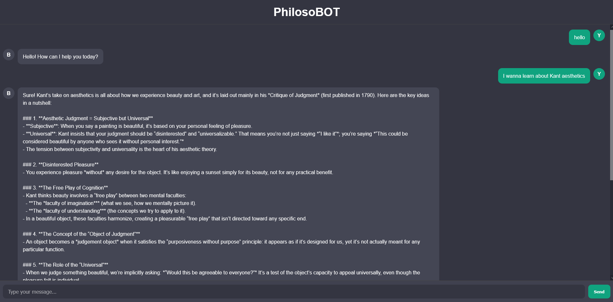

# 🧠 Philosobot — A Chatbot for Thoughtful Conversations

**Philosophbot** is an intelligent chatbot designed to engage in meaningful conversations — especially about **philosophy** — while remaining conversational and human-like on general topics.  

Built with **Flask**, **React**, **Docker**, and powered by **LLaMA-based models** using **Groq API**, this project demonstrates a clean and scalable setup for an AI-driven application.

---

## 🚀 Features

- 💬 **Conversational Chatbot:** Naturally interacts with users; shifts into philosophical mode when asked.  
- 🦙 **Groq + LLaMA Integration:** Uses Groq’s optimized large language models for low-latency inference.  
- 🌐 **Full-Stack Setup:** Flask backend with a React frontend, containerized with Docker.  


---

## 🛠️ Setup & Installation

### 1. Clone the Repository

```bash
git clone https://github.com/Valadis-Mastoras/PhilosoBOT.git
cd PhilosoBOT
```

### 2. Fill in the .env File

You should create a GROQ API KEY and place it in the relevant variable in .env file. 

Currently, please ignore the POSTGRESS .env variable as this refers to a future development stage.

### 3. Build and Run with Docker Compose

```bash
docker-compose up --build
```

Chatbot runs on http://localhost:5001


## 🚧 Project Status

This project is **still under active development**.  
Upcoming features include:  

- 🧩 **RAG (Retrieval-Augmented Generation)** on a curated corpus of **philosophical texts**, enabling the model to provide grounded, reference-based responses.  
- 🧠 **Chat Memory & History**, allowing the bot to retain conversational context and continuity across multiple interactions.  
- 🗄️ **PostgreSQL Integration** to store chat histories and user sessions for efficient retrieval and long-term memory.

These enhancements aim to make Philosobot more context-aware, informed, and capable of deep, textually-supported discussions.


## 🖼️ Screenshot

